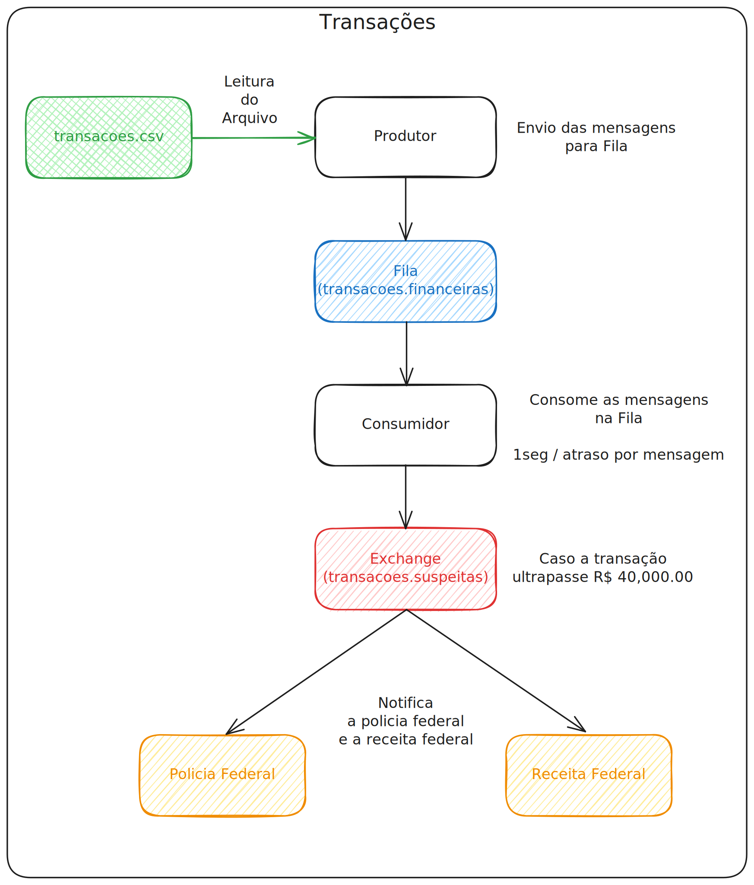

# Transações
Este projeto foi desenvolvido como parte de um trabalho acadêmico universitário, com o objetivo de simular o processamento de transações financeiras utilizando mensageria. A seguir, você encontrará um fluxograma que ilustra o funcionamento do sistema.

Trata-se de um projeto multi-módulo Maven, dividido em quatro componentes:
- Produtor
- Consumidor
- Polícia Federal
- Receita Federal.

As seguintes tecnologias foram usadas:
- **[Spring Boot](https://spring.io/projects/spring-boot)**: É uma ferramenta que facilita e agiliza o desenvolvimento de aplicativos da web e de microsserviços com o Spring Framework.

- **[Spring AMQP](https://spring.io/projects/spring-amqp)**: Usado para a comunicação com o RabbitMQ.

## Rodando o projeto
Para obter uma cópia local do projeto e colocá-lo em funcionamento, siga os passos abaixo:

### 1. Clone o repositório e navegue até o diretório do projeto:

Abra um terminal e execute os seguintes comandos para clonar o repositório e acessar o diretório do projeto:
```bash
git clone https://github.com/lucasbpo/transacoes.git
cd transacoes
```

### 2. Inicie o RabbitMQ usando o Docker

Execute o comando abaixo para iniciar uma instância do RabbitMQ em segundo plano, utilizando o Docker Compose:
```bash
docker compose up -d
```

### 3. Inicialize o módulo `produtor`. 

O próximo passo é iniciar o módulo produtor, que é responsável por criar as filas, configurar o exchange e popular a fila `transacoes.financeiras` na instância do RabbitMQ.

Para isso, execute os seguintes comandos:

```bash
cd produtor
./mvnw spring-boot:run
```

### 4. Inicie os outros módulos
    
Agora, repita o mesmo processo para os outros módulos do projeto.

**Recomendação**: Abra um terminal separado para cada módulo, assim você poderá acompanhar o processamento de cada um em tempo real. 

## Fluxograma
Abaixo, você pode visualizar o fluxograma que descreve o funcionamento do sistema:
